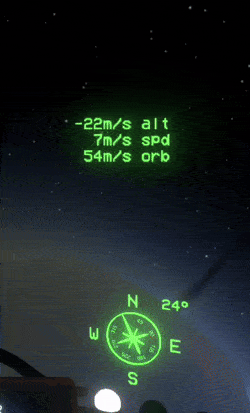

# Flight Path Vector
 This mod adds 7 markers from Kerbal Space Program to help you visualize your ship trajectory, and numerous HUD displaying important information about your trajectory

**Features**

**Prograde :** Will point in the direction in which your ship is heading 

**Retrograde :** Will point in the direction opposite to which your ship is heading

**Radial-In :** Perpendicular to the Prograde, will point toward the selected target

**Radial-Out :** Perpendicular to the Prograde, will point away from the selected target

**Normal :** Parallel to the selected target, it points to the right of the target

**Anti-Normal :** Parallel to the selected target, it points to it's the left of the target

**Maneuver :** Adjustable marker, will point in a direction selected by the player

**Artificial Horizon :** Two lines parallel to the target, symbolize the ship's rotation relative to the ground

**Altimeter :** Similar to the altimeter present near the landing camera screen, but instead displayed on the cockpit, helps to better vizualise how close your are to the ground

**Compass :** Display the ship rotation in relation to the target north pole, usefull if you had trouble finding poles while in the ship

**Rate of Closure :** Display how fast your ship is approaching the target

**Surface Speed :** Display how fast your ship is going, parallel to the surface of the target. Usefull if you ever wondered how fast you were going while flying around a planet.

**True Speed :** Display how fast your ship is going toward the Prograde, this is your total speed.

**Acceleration :** Display how much your ship speed is changing per seconds.

**Orbital Speed :** Display the surface speed you would need to have to orbit the selected target. To enter a circular orbit, your surface speed must match the orbital speed, while the rate of closure must be at 0.