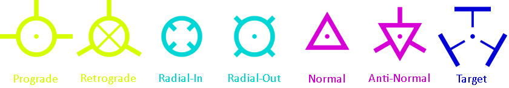

# Flight Path Vector
 This mod adds 7 markers from Kerbal Space Program to help you visualize your ship trajectory

**Features**

**Prograde :** Will point in the direction in which your ship is heading 

**Retrograde :** Will point in the direction opposite to which your ship is heading

**Radial-In :** Perpendicular to the Prograde, will point toward the selected target

**Radial-Out :** Perpendicular to the Prograde, will point away from the selected target

**Normal :** Parallel to the selected target, it points to the right of the target

**Anti-Normal :** Parallel to the selected target, it points to it's the left of the target

**Maneuver :** Adjustable marker, will point in a direction selected by the player

**Artificial Horizon :** Two lines parallel to the target, symbolize the ship's rotation relative to the ground